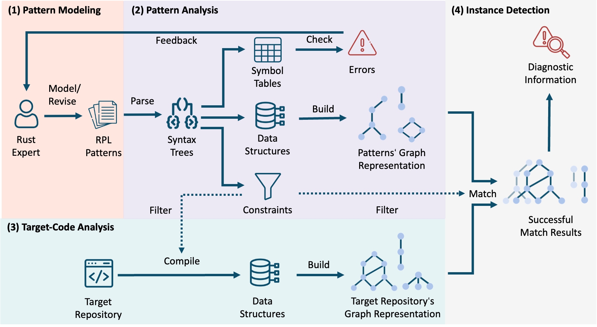

# Workflow

The workflow of RPL is shown in the figure above, which conceptually comprises four main activities:
(1) pattern modeling, (2) pattern analysis, (3) target-code analysis, and (4) instance detection.

The process begins when a user models a set of patterns with the pattern modeling DSL,
thereby supplying the inputs for subsequent analysis.
During pattern analysis, each pattern is parsed into an Abstract Syntax Tree (AST) and then processed into its core components:
a symbol table, a structural representation, and a set of semantic constraints.
The symbol tables are used to check the internal errors,
providing a feedback loop for the developer to revise the patterns.
After validation, the structural representation is next transformed into the pattern graph representation.
Target-code analysis compiles the Rust repository and retrieves the compiler’s intermediate representations.
These artifacts are converted into the target graph representation.

Once the graph representations for both the pattern and the target code are ready,
the analysis proceeds to a three-stage matching, filtering, and reporting process.
First, the detection engine uses a graph matching algorithm to find all target code segments that structurally match the pattern's graph.
Next, these candidate matches pass through a filtering stage where semantic constraints declared in the pattern are applied.
Only the matches that satisfy both the structural and semantic conditions are considered valid findings.
Finally, these validated results are processed into compiler-friendly diagnostic messages to report the potential issues in the target code to the developer.
